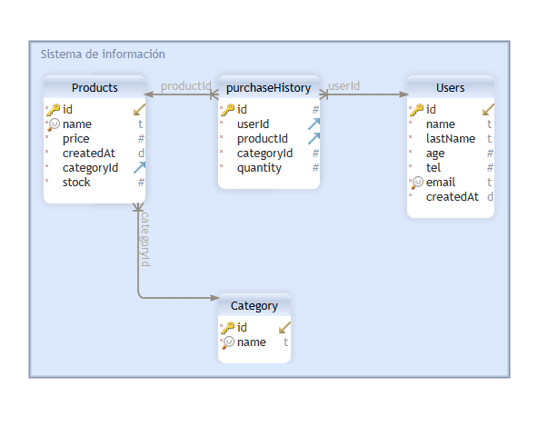

# Backend API


[TOC]

Esta es una **REST API** desarrollada con el framework **Express** de **Node.js** para manejar un sistema de información alojado en una base de datos local con el engine **SQLite**. Desde la API se hace uso de **Prisma Client** para realizar los queries a la base de datos:

- Usuarios : Users
- Productos : Products 
- Categorías : Category 
- Historial de compras : purchaseHistory



## Testing


- Ejecutar el siguiente comando para inicializar el API

`npm start`

- Realizar las operaciones CURD hacia la siguiente URL:

`http://localhost:3000`

- En la base de datos se tiene ya registrado algunas entradas para cada una de las tablas.

- Operaciones de consulta como ejemplo para realizar con el comando `curl` :

  - Obtener registro de todos los usuarios
    ```bash
    curl -XGET 'http://localhost:3000/users'
    ```
  - Obtener información del usuario con ID 4
    ```bash
    curl -XGET 'http://localhost:3000/users/4'
    ```
  - Obtener todos los registros de los productos
    ```bash
    curl -XGET 'http://localhost:3000/products/'
    ```
  - Crear una categoria
    ```bash
    curl -XPOST -H "Content-type: application/json" -d '{
            "name": "neumaticos"
        }' 'http://localhost:3000/categories/'
    ```
  - Crear un producto
    ```bash
    curl -XPOST -H "Content-type: application/json" -d '{
            "name": "Papas fritas la victoria",
            "price": 2500,
            "categoryId": 10
        }' 'http://localhost:3000/products/'
    ```
  - Eliminar un usuario con ID 4
    ```bash
    curl -XDELETE 'http://localhost:3000/users/4'
    ```
  - Realizar una compra con el usuario ID 5, producto con ID 2, cantidad 5
    ```bash
    curl -XPOST -H "Content-type: application/json" -d '{
        "userId": 5,
        "productId":2,
        "quantity":5
    }' 'http://localhost:3000/functions/buy'
    ```
  - Realizar compra excediendo la cantidad que hay en inventario
    ```bash
    curl -XPOST -H "Content-type: application/json" -d '{
        "userId": 5,
        "productId":2,
        "quantity":99999
    }' 'http://localhost:3000/functions/buy'
    ```
  - Modificar entrada en historial de compras
    ```bash
    curl -XPATCH -H "Content-type: application/json" -d '{
            "userId": 4,
            "productId": 2,
            "quantity": 26
        }' 'http://localhost:3000/purchases/2'
    ```
    
    

## Estructura de la base de datos

A continuación se describe los campos y el tipo de entrada para cada base de datos junto a un ejemplo.

Nota: 

> Los campos con * se generan automáticamente al no ser especificado un valor.
>
> Los campos con ? deben ser únicos en la base de datos. No puede haber duplicados.

### Usuarios

| **NOMBRE** | **TIPO** | **DESCRIPCIÓN**      |
| ---------- | -------- | -------------------- |
| *id        | Int      | ID único del usuario |
| name       | String   | Nombre               |
| lastName   | String   | Apellidos            |
| age        | Int      | Edad                 |
| tel        | Int      | Telefóno/Celular     |
| ?email     | String   | Correo eléctronico   |
| *createdAt | DateTime | Fecha de creación    |

Ejemplo:

```json
  {
    "id": 2,
    "name": "Maria",
    "lastName": "Lopez",
    "age": 25,
    "tel": 8888888,
    "email": "correo2@domain.com",
    "createdAt": "2021-10-23T22:55:46.260Z"
  }
```

### Productos

| **NOMBRE**  | **TIPO** | **DESCRIPCIÓN**                               |
| ----------- | -------- | --------------------------------------------- |
| *id         | Int      | ID único del producto                         |
| ?name       | String   | Nombre del producto                           |
| *price      | Int      | Precio                                        |
| *createdAt  | DateTime | Fecha de creación                             |
| *categoryId | Int      | ID del producto en la tabla de Categorías     |
| *stock      | Int      | Cantidad de unidades disponibles del producto |

Ejemplo:

```json
    {
        "id": 17,
        "name": "Televisor",
        "price": 6500000,
        "createdAt": "2021-10-24T15:31:57.432Z",
        "categoryId": 3,
        "stock": 0,
    }			
```


### Categorías

| **NOMBRE** | **TIPO** | **DESCRIPCIÓN**              |
| ---------- | -------- | ---------------------------- |
| id         | Int      | ID único de la categoría     |
| ?name      | String   | Nombre único de la categoría |

Ejemplo:

```json
    {
        "id": 2,
        "name": "enlatados"
    }
```


### Historial de compras 

| **NOMBRE**  | **TIPO** | DESCRIPCIÓN                      |
| ----------- | -------- | -------------------------------- |
| *id         | Int      | ID único de la entrada de compra |
| userId      | Int      | ID único del usuario             |
| productId   | Int      | ID único del producto            |
| *categoryId | Int      | ID único de la categoría         |
| *quantity   | Int      | Cantidad de unidades compradas   |

Ejemplo:

```json
    {
        "id": 2,
        "userId": 4,
        "productId": 2,
        "categoryId": 3,
        "quantity": 15
    }
```

## Funciones del API

### Usuarios

Las funciones que se disponen para la base de datos de `Usuarios` son las siguientes

- Consultar el registro de todos los usuarios. Como respuesta se obtiene un objeto `JSON` con la información.

```html
GET http://<server name>/users
```
- Consultar la entrada de un usario en especifico. El `{id}` en el PATH corresponde al ID del usuario a consultar. Se recibe como respuesta un objeto `JSON` con la información de la entrada eliminada

```html
GET http://<server name>/users/{id}
```


- Solicitar la creación de una nueva entrada en la base de datos.

```html
POST http://<server name>/users
```

Se debe se adjuntar un objeto `JSON` al body de la solicitud donde se debe mínimo especificar los siguientes campos:

```json
    {
        "name": "name",
        "lastName": "lastName",
        "age": 0,
        "tel": 0,
        "email": "email@domain.com"
    }
```

- Eliminar entrada de un usuario en la base de datos. El `{id}` en el PATH corresponde al ID del usuario a eliminar. Se recibe como respuesta un objeto `JSON` con la información de la entrada eliminada


```html
DELETE http://<server name>/users/{id}
```
**ADVERTENCIA: Al eliminar un usuario se eliminará automáticamente todos los registros asociados a este producto en las tablas `historial de compras`**

- Realizar una modificación parcial o completa de una entrada de un usuario en la base de datos. El `id` en el PATH corresponde al ID del usuario a modificar.

```html
PATH http://<server name>/users{id}
```
Se debe se adjuntar un objeto `JSON` al body de la solicitud donde se debe minimo especificar alguno de los siguientes campos:

```json
    {
        "id": 6,
        "name": "Francisco",
        "lastName": "Polaina",
        "age": 18,
        "tel": 678678458,
        "email": "correo442@domain.com",
        "createdAt": "2021-10-24T12:03:05.481Z"
    }
```

### Productos

- Consultar el registro de todos los productos. Como respuesta se obtiene un objeto `JSON` con la información.

```html
GET http://<server name>/products
```
- Consultar la entrada de un producto en especifico. El `{id}` en el PATH corresponde al ID del producto a consultar. Se recibe como respuesta un objeto `JSON` con la información de la entrada eliminada

```html
GET http://<server name>/products/{id}
```

- Solicitar la creación de una nueva entrada en la base de datos.

```html
POST http://<server name>/products
```
Se debe se adjuntar un objeto `JSON` al body de la solicitud donde se debe minimo especificar los siguientes campos:

```json
    {
        "name": "Televisor",
        "price": 6500000,
        "categoryId": 3
    }
```

Nota: El producto se creará con un stock en inventario igual a cero `0`. Para cambiar el valor se debe usar la funcion descrita a continuación.

- Añadir o remover una `{cantidad}` especifica de la unidades que hay del producto  con `{id}` indicado en el PATH. Para remover unidades del producto el valor número en `{cantidad}` debe ser negativo, en caso de que la cantidad especificada sea mayor la disponibilidad del producto, se recibirá un mensaje de error 400 indicando lo mismo.  Se obtiene como respuesta un objeto `JSON` con la información de la entrada modificada.

  ```html
  PATH http://<server name>/products/{id}/{cantidad}
  ```

- Eliminar entrada de un producto en la base de datos. El `{id}` en el PATH corresponde al ID del producto a eliminar. Se recibe como respuesta un objeto `JSON` con la información de la entrada eliminada

```html
DELETE http://<server name>/products/{id}
```

**ADVERTENCIA: Al eliminar un producto se eliminará automáticamente todos los registros asociados a este producto en las tablas `historial de compras`**

- Realizar una modificación parcial o completa de una entrada de un producto en la base de datos. El `id` en el PATH corresponde al ID del producto a modificar.

```html
PATH http://<server name>/products{id}
```

Se debe se adjuntar un objeto `JSON` al body de la solicitud donde se debe minimo especificar alguno de los siguientes campos:

```json
    {
        "id": 17,
        "name": "Televisor",
        "price": 6500000,
        "createdAt": "2021-10-24T15:31:57.432Z",
        "categoryId": 3,
        "stock": 0
    }
```

### Categorías

- Consultar el registro de todos los categorias. Como respuesta se obtiene un objeto `JSON` con la información.

```html
GET http://<server name>/categories
```

- Consultar la entrada de una categoría en especifico. El `{id}` en el PATH corresponde al ID de la categoría a consultar. Se recibe como respuesta un objeto `JSON` con la información de la entrada eliminada

```html
GET http://<server name>/categories/{id}
```

- Solicitar la creación de una nueva entrada en la base de datos.

```html
POST http://<server name>/categories
```

Se debe se adjuntar un objeto `JSON` al body de la solicitud donde se debe minimo especificar los siguientes campos:

```json
    {
        "id": 2,
        "name": "tecnología"
    }
```

- Eliminar entrada de una categoría en la base de datos. El `{id}` en el PATH corresponde al ID de la categoría a eliminar. Se recibe como respuesta un objeto `JSON` con la información de la entrada eliminada

```html
DELETE http://<server name>/categories/{id}
```

**ADVERTENCIA: Al eliminar una categoría se eliminará automáticamente todos los registro asociados a esta categoría en las tablas de `productos` y `historial de compras`**

- Realizar una modificación parcial o completa de una entrada de una categoría en la base de datos. El `id` en el PATH corresponde al ID de la categoría a modificar.

```html
PATH http://<server name>/categories/{id}
```

Se debe se adjuntar un objeto `JSON` al body de la solicitud donde se debe minimo especificar alguno de los siguientes campos:

```json
    {
        "id": 2,
        "name": "tecnología"
    }
```

### Historial de compras

- Consultar el registro de todo el historial de compras. Como respuesta se obtiene un objeto `JSON` con la información.

```html
GET http://<server name>/purchases
```

- Consultar la entrada de una compra en especifica. El `{id}` en el PATH corresponde al ID de la compra a consultar. Se recibe como respuesta un objeto `JSON` con la información de la entrada eliminada

```html
GET http://<server name>/purchases/{id}
```

- Solicitar la creación de una nueva entrada en la base de datos.

```html
POST http://<server name>/purchases
```

Se debe se adjuntar un objeto `JSON` al body de la solicitud donde se debe minimo especificar los siguientes campos:

```json
    {
        "userId": 4,
        "productId": 2,
        "quantity": 15
    }
```

- Eliminar entrada de una compra en la base de datos. El `{id}` en el PATH corresponde al ID de la entrada de la compra a eliminar. Se recibe como respuesta un objeto `JSON` con la información de la entrada eliminada

```html
DELETE http://<server name>/purchases/{id}
```

- Realizar una modificación parcial o completa de una entrada de una categoría en la base de datos. El `id` en el PATH corresponde al ID de la categoría a modificar.

```html
PATH http://<server name>/purchases/{id}
```

A diferencia de las funciones anteriores, en esta se debe especificar exactamente los campos mencionados abajo. Se debe se adjuntar un objeto `JSON` al body de la solicitud donde se debe especificar los siguientes campos:

```json
    {
        "userId": 4,
        "productId": 2,
        "quantity": 15
    }
```

### Funciones

- Función de compra. Esta funcion obtiene un objeto `JSON` que debe contener el `{id}` del producto a comprar, la `{cantidad}` y el `{usuario}` que realiza la compra

```html
POST http://<server name>/functions/buy
```
Ejemplo:

```json
{
    "userId": 1,
    "productId":1,
    "quantity":1
} 
```

